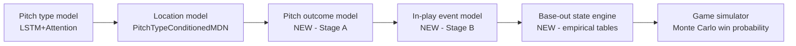

# Pitch Outcome Model Plan

Goal: predict the outcome of a pitch given the pitcher, the pitch (type + location),
the batter, and the game situation — completing the model chain needed to simulate
at-bats, innings, and full games for win probabilities.

## Where this fits

We already have two of the three links:

- `P(pitch_type | sequence)` — exists (`src/ml/model.py`, LSTM+Attention)
- `P(px, pz | features, type)` — exists (`src/ml/pitch_type_location_model.py`, MDN)
- `P(result | type, location, matchup, count)` — **Stage A, new**
- `P(event | in-play, matchup, situation)` — **Stage B, new**
- base-out advancement + runs — **empirical transition tables, new**

## Data inventory (verified against `mlb.pitches`, 2026-08-08)

All labels already exist in PostgreSQL — no schema change required.

- ~9.3M pitches from 2015+ with `pitch_call_description`
- ~1.68M in-play rows with terminal `event_type`
- Runner state per pitch: `is_runner_on_{first,second,third}` + runner IDs
- Situation per pitch: `count_after_pitch`, `outs`, `inning`, `half_inning`, scores
- Physics per pitch: `px/pz`, speed, break, spin (inputs, not labels)
- **Not stored:** GUMBO `hitData` (launch speed/angle). Optional ETL extension,
  not required for v1.

### Stage A label mapping (per-pitch result, 7 classes)

| Class | Source `pitch_call_description` values |
|---|---|
| `ball` | Ball, Ball In Dirt, Automatic Ball* |
| `called_strike` | Called Strike, Automatic Strike* |
| `swinging_strike` | Swinging Strike, Swinging Strike (Blocked), Missed Bunt, Foul Tip |
| `foul` | Foul, Foul Bunt |
| `in_play` | In play, out(s) / no out / run(s) |
| `hit_by_pitch` | Hit By Pitch |
| *excluded rows* | Pickoff Attempt {1B,2B,3B}, Pitcher Step Off, Pitchout, None/null |

Notes: foul tip counts as a strike (strikeout on 2 strikes) which matches
`swinging_strike` semantics in a count state machine. Intentional balls are
excluded from training but handled in the simulator as a managerial rule, not
a model output.

### Stage B label mapping (in-play event, 6 classes)

| Class | Source `event_type` values |
|---|---|
| `out` | field_out, force_out, grounded_into_double_play, double_play, fielders_choice(_out), sac_fly(_double_play), sac_bunt(_double_play), triple_play |
| `single` | single |
| `double` | double |
| `triple` | triple |
| `home_run` | home_run |
| `reached_on_error` | field_error, catcher_interf |

Double plays are not a classifier output: model `P(DP | out, runner on 1st, <2 outs)`
as a small empirical table applied inside the base-out engine.

## Model design

### Stage A — pitch result

- **v1: CatBoost multiclass** (repo already depends on catboost; matches
  `src/ml/catboost_model.py` conventions). Fast to train, natively handles the
  categorical identity features, gives calibrated-ish probabilities to start.
- Features:
  - pitch: type (11 codes), `px`, `pz`, zone-geometry (distance from zone center,
    normalized height using `strike_zone_top/bottom`, in-zone flag)
  - count/state: balls, strikes, outs, runners bitmap, inning, score diff
  - matchup: `pitcher_id`, `batter_id` as categoricals, platoon (throw × bat side)
  - context: season, home/away, times-through-order (derivable from at_bat_index)
  - **pitch physics profiles** (see below): rolling pitcher × pitch-type stats for
    velocity, spin rate, spin direction, induced vertical break, horizontal break,
    and release point (`x0`, `z0`)
  - rolling identity priors (v1.5): batter swing%/whiff%/chase% and pitcher
    whiff%-by-pitch-type computed as leak-free expanding means (shifted, like the
    cumulative features in `src/ml/features.py`)
- **v2: multi-task head on the existing LSTM encoder** — share the sequence
  representation the pitch-type model already builds; likely the biggest accuracy
  win, but only after the CatBoost baseline sets the bar.

### Pitch physics features

All Statcast physics are already stored per pitch (`pitch_start_speed`,
`pitch_end_speed`, `spin_rate`, `spin_direction`, `break_vertical_induced`,
`break_horizontal`, `pfxx/pfxz`, release `x0/z0`, velocity/acceleration vectors).
They enter the outcome models as **pitcher profiles, not raw measurements**:

- **Why not raw per-pitch physics:** at simulation time the pitch is *generated* —
  we sample type and location, so there is no measured spin/velo for that pitch.
  Conditioning on unobservable inputs would break the generative chain.
- **v1 — profiles:** leak-free rolling means/stds per pitcher × pitch type ×
  season (shifted expanding windows, same discipline as `features.py`). These are
  lookups at sim time and capture pitch *quality* — a 97.8 mph / 2380 rpm / +16"
  IVB four-seam grades differently from a league-average one at the same location.
  Deltas vs league average per type are the model-friendly form.
- **v1 bonus:** within-game velocity trend vs profile (fatigue signal) is
  computable live and in sim (pitch count is tracked).
- **v1.5 — empirical physics resampler:** to simulate a pitch, draw an actual
  historical `(velo, spin, IVB, HB, release)` tuple at random from that
  pitcher's pitches of that type. Whole-tuple resampling preserves the joint
  structure for free — physics are coupled through arm speed and spin axis, so
  independent marginal draws would produce impossible pitches (98 mph with
  curveball break). Training uses measured physics; simulation feeds sampled
  ones — valid because the empirical distribution matches the real conditional
  by construction. Details:
  - *sparsity backoff:* few observations (rookies, new pitches) → shrink toward
    the league distribution for that pitch type (same philosophy as the
    unknown-player embedding fallback)
  - *recency:* sample from a rolling window (current + prior season), not career
  - *fatigue:* bucket draws by pitch-count band, or shift sampled velo by the
    pitcher's observed within-game trend
  - *known approximation:* ignores physics↔location correlation (commanded pitch
    vs. miss); acceptable v1, revisit if calibration flags it
- **v2 — learned physics sampler (stretch):** `P(velo, movement | pitcher, type,
  count, pitch_count)` only if the empirical resampler's calibration falls short.

### Batter swing physics

The batter-side analog, with one hard data constraint: **GUMBO carries no bat
tracking**. Verified against the feed: `hitData` has `launchSpeed`,
`launchAngle`, `totalDistance`, `trajectory` per ball in play — but bat speed
and swing length exist only in Baseball Savant's Statcast exports, and only
since April 2024.

- **v1 — behavior profiles (existing data):** rolling batter priors already
  planned for Stage A (swing%, whiff%, chase%, contact% by zone/pitch type).
  These proxy bat-to-ball skill without any new ETL.
- **v1.5 — `hitData` ETL extension:** add launch speed/angle to the pitches
  ETL (columns exist in every stored live feed, just not extracted). Exit
  velocity is the *product* of bat speed and is available back to 2015. This
  unlocks:
  - per-batter **(EV, LA) joint distributions** — the batter equivalent of the
    pitcher physics resampler, sampled at contact
  - an alternative **xwOBA-style Stage B**: sample `(EV, LA)` from the batter's
    distribution (conditioned on pitch type/location bucket), then map
    `(EV, LA) → event` with a league-wide model. Removes park/defense noise
    from the batter representation and is likely better calibrated than direct
    event classification; evaluate both.
- **v2 — Savant bat-tracking ingestion (stretch):** bat speed / swing length as
  batter profile features. New ingestion path (pybaseball/Savant CSV), 2024+
  coverage only, so it needs explicit missingness handling for earlier seasons;
  justified only if EV/LA profiles leave measurable calibration gaps.

### Stage B — in-play event

- Same v1 architecture (CatBoost multiclass), trained only on `in_play` rows.
- Features: everything Stage A sees. Batted-ball physics would help most here;
  if v1 underperforms, the highest-leverage improvement is the `hitData` ETL
  extension (launch speed/angle) rather than model complexity.

### Simulation chain (`src/sim/`, new package)

1. **PA simulator**: sample type → location → Stage A result → update count;
   terminal states: K, BB, HBP, in-play → Stage B event.
2. **Base-out engine**: empirical advancement tables built from our own pitches
   data (event × runners × outs → new state + runs). RE288-style, no model.
3. **Game simulator**: half-inning loop over lineups; v1 pitcher changes by
   simple pitch-count rules. Win probability = Monte Carlo (N≈1000) from any
   game state — which plugs directly into the live bot's `LiveSnapshot`.

### Key engineering risk: simulation speed

Measured: `LiveNextPitchPredictor.predict` ≈ **0.24s per pitch** (single, CPU).
A game is ~300 pitches, so naive 1000-game Monte Carlo is ~20 hours — unusable.
Mitigations, in order:
1. **Batch across simulations** — run the N simulated games in lock-step and
   batch model inference per step (torch/CatBoost both amortize well).
2. Cache per-matchup distributions within a sim (type/location distributions
   change slowly within an at-bat).
3. If still too slow, distill the chain into matchup-conditioned lookup tables
   for sim use, keeping the full models for the live card path.

## Training & evaluation

- Splits: train 2015–2023, val 2024, test 2025 (matches `src/ml/season_splits.py`
  defaults). Include `season` as a feature; the 2023 pitch clock and shift ban are
  real distribution shifts.
- Tracking: MLflow, same convention as `scripts/train_models_with_mlflow.py`.
- Baselines that must be beaten:
  - Stage A: count-conditioned league-average result rates
  - Stage B: league-average event rates by pitch type + platoon
- Metrics:
  - multiclass log loss + per-class calibration curves (probabilities are the
    product — the simulator consumes them directly, so calibration > accuracy)
  - derived-stat sanity: simulated K%, BB%, HR%, BABIP, wOBA per matchup bucket
    vs actual 2025 values
  - end-to-end: simulate held-out 2025 games from real lineups; compare run
    distributions and home win% vs actuals

## Milestones

1. **Label builder** — polars dataset module (`src/ml/outcome_data.py`): cleaned
   Stage A/B labels + features from PostgreSQL, with exclusion rules above.
2. **Stage A CatBoost baseline** + eval report vs count-conditioned baseline.
3. **Stage B CatBoost baseline** + eval report.
4. **Base-out transition tables + PA simulator** with unit tests against known
   count-transition identities (e.g. foul at 2 strikes keeps 2 strikes).
5. **Game simulator + win-probability CLI** (`scripts/simulate_game.py`),
   validated on 2025 test games; batched inference from day one.
6. **Calibration pass + MLflow training script** (`scripts/train_outcome_models.py`).
7. *Stretch:* multi-task LSTM head; `hitData` ETL extension; live win-probability
   overlay on the Bluesky cards.

## Open decisions (defaults chosen, revisit if needed)

- Stolen bases / wild pitches / balks: **out of scope v1** (small run impact,
  large modeling surface). The base-out tables absorb their average effect.
- Reached-on-error: kept as its own class (it is ~1% of balls in play and
  team-defense dependent; folding into `single` is acceptable if it hurts
  calibration).
- Training era: 2015+ chosen over 2009+ for Statcast-era consistency; cheap to
  re-run with the full window later since the loader is season-parameterized.

## Operational TODOs

- Shared MLflow metadata alone is not enough for multi-machine live inference:
  the outcome models currently load artifacts from local disk. Future options:
  teach the live pipeline to pull the latest artifacts via MLflow, move artifacts
  to a truly shared backend, or add an explicit sync step for `models/outcome/`.
- The `mlb.pitches` table's `outs` column is dead (always 0: the ETL read a
  nonexistent `about.outs` on pitch events) and its `is_runner_on_*` flags
  only reflected runners who moved during the play. Both are fixed at the
  source (`src/data/base_state.py` reconstruction wired into
  `GameFeedData`), but the database still holds the old values until the
  next full backfill reload. The sim base-out tables already bypass the DB
  by reading raw live feed JSONs.
- **The mover-only runner flags were a label leak for the outcome models**:
  `runner_on_first` was set on ~36% of singles vs ~14% of outs (a runner
  who moves is recorded; runners move on hits). Simulation exposed it as a
  6pp singles deficit when feeding honest all-false flags. `outs` and
  `runner_on_*` are removed from `FEATURE_COLUMNS` and the models retrained
  leak-free; reinstate the (reconstructed) state features only after the DB
  reload, and expect the leaky-era val/test metrics to have been flattered.
- **Raw player-ID categoricals caused an off-window calibration cliff**:
  CatBoost ordered target statistics for `pitcher_id_cat`/`batter_id_cat`
  made aggregate P(in_play) ~2pp low on training seasons and ~6pp high on
  every season after the training window (23.2% predicted vs 17.4% actual
  on 2024/2025) — and all production inference is off-window. IDs are
  removed from the feature set (skill flows through physics profiles and
  batter priors) and remaining low-cardinality categoricals train one-hot
  (`one_hot_max_size=16`, no CTRs). Revisit identity features later as
  explicit smoothed train-computed encodings if the residual nuance is
  worth it.
- Count-conditioned pitch inputs for simulation are in: per-pitcher
  P(type | count) with league shrinkage plus per-(count, type) location
  pools (`src/sim/pitch_mix.py`, exported by `scripts/export_pitch_mix.py`).
  The live one-pitch card path still uses the LSTM/MDN distributions.
- Stage B is ~2pp conservative on outs even on real rows (pred 69.2% vs
  actual 67.1% on 2025 contact with the leaky-era model; ~1.3pp with the
  CTR-free retrain); fold into the milestone-6 calibration pass.
- Milestone-5 validation snapshot (30 random 2025 games x 300 sims): the
  promoted full-window model `run_20260809_145546` (train 2015-2023,
  Stage A val/test 0.9711/0.9734, Stage B 0.9564/0.9542, both leak-free and
  CTR-free) simulates 9.70 mean total runs vs 8.50 actual (+14%: K% ~3pp
  low, HBP ~2x, Stage B ~1.2pp out-conservative, generic bullpen arm too
  soft) with home-win Brier 0.249 and a narrow 0.38-0.62 p(home) spread —
  no home-field advantage, bullpen identity, or team form modeled yet.
  It is the shared-MLflow production pair (stage A
  `eb511a86bade433c99e067aa76fd666e`, stage B
  `bbdcc4134272408ba9f03d6cf6ede89b`); the leaky-era imports are demoted
  (`production_model=false`). Milestone-6 calibration targets: per-stage
  post-hoc calibrators, a league-average synthetic profile row for the
  generic bullpen arm (id 0), HBP location handling, and home advantage.
- Win-probability baselines (120 random 2025 games x 200 sims, production
  model): model Brier 0.2487 vs coin 0.2500, constant league home rate
  (p=0.543) 0.2468, always-home hard pick 0.4417; pick accuracy model 50.8%
  vs always-home 55.8%. The model beats coin and crushes hard home-picking
  but does NOT yet beat the constant home-advantage baseline: its mean
  p(home) is 0.519 vs 0.558 actual because no home-field term exists.
  Adding the milestone-6 home-advantage term is the cheapest expected win.
  `scripts/simulate_game.py --validate` now prints these baselines.
- Evaluation standard (owner request): report BOTH Brier score and log loss
  for the stage models and for game-level win predictions. The trainer logs
  stage val/test log loss + multiclass Brier to MLflow;
  `scripts/simulate_game.py --validate` logs game-level win Brier/log loss
  with coin, league-home-rate, and always-home baselines when
  `MLFLOW_TRACKING_URI` is set.
