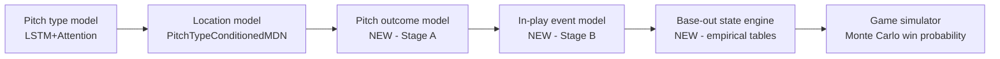

# Pitch Outcome Model Plan

Goal: predict the outcome of a pitch given the pitcher, the pitch (type + location),
the batter, and the game situation — completing the model chain needed to simulate
at-bats, innings, and full games for win probabilities.

## Where this fits

We already have two of the three links:

- `P(pitch_type | sequence)` — exists (`src/ml/model.py`, LSTM+Attention)
- `P(px, pz | features, type)` — exists (`src/ml/pitch_type_location_model.py`, MDN)
- `P(result | type, location, matchup, count)` — **Stage A, new**
- `P(event | in-play, matchup, situation)` — **Stage B, new**
- base-out advancement + runs — **empirical transition tables, new**

## Data inventory (verified against `mlb.pitches`, 2026-08-08)

All labels already exist in PostgreSQL — no schema change required.

- ~9.3M pitches from 2015+ with `pitch_call_description`
- ~1.68M in-play rows with terminal `event_type`
- Runner state per pitch: `is_runner_on_{first,second,third}` + runner IDs
- Situation per pitch: `count_after_pitch`, `outs`, `inning`, `half_inning`, scores
- Physics per pitch: `px/pz`, speed, break, spin (inputs, not labels)
- **Not stored:** GUMBO `hitData` (launch speed/angle). Optional ETL extension,
  not required for v1.

### Stage A label mapping (per-pitch result, 7 classes)

| Class | Source `pitch_call_description` values |
|---|---|
| `ball` | Ball, Ball In Dirt, Automatic Ball* |
| `called_strike` | Called Strike, Automatic Strike* |
| `swinging_strike` | Swinging Strike, Swinging Strike (Blocked), Missed Bunt, Foul Tip |
| `foul` | Foul, Foul Bunt |
| `in_play` | In play, out(s) / no out / run(s) |
| `hit_by_pitch` | Hit By Pitch |
| *excluded rows* | Pickoff Attempt {1B,2B,3B}, Pitcher Step Off, Pitchout, None/null |

Notes: foul tip counts as a strike (strikeout on 2 strikes) which matches
`swinging_strike` semantics in a count state machine. Intentional balls are
excluded from training but handled in the simulator as a managerial rule, not
a model output.

### Stage B label mapping (in-play event, 6 classes)

| Class | Source `event_type` values |
|---|---|
| `out` | field_out, force_out, grounded_into_double_play, double_play, fielders_choice(_out), sac_fly(_double_play), sac_bunt(_double_play), triple_play |
| `single` | single |
| `double` | double |
| `triple` | triple |
| `home_run` | home_run |
| `reached_on_error` | field_error, catcher_interf |

Double plays are not a classifier output: model `P(DP | out, runner on 1st, <2 outs)`
as a small empirical table applied inside the base-out engine.

## Model design

### Stage A — pitch result

- **v1: CatBoost multiclass** (repo already depends on catboost; matches
  `src/ml/catboost_model.py` conventions). Fast to train, natively handles the
  categorical identity features, gives calibrated-ish probabilities to start.
- Features:
  - pitch: type (11 codes), `px`, `pz`, zone-geometry (distance from zone center,
    normalized height using `strike_zone_top/bottom`, in-zone flag)
  - count/state: balls, strikes, outs, runners bitmap, inning, score diff
  - matchup: `pitcher_id`, `batter_id` as categoricals, platoon (throw × bat side)
  - context: season, home/away, times-through-order (derivable from at_bat_index)
  - rolling identity priors (v1.5): batter swing%/whiff%/chase% and pitcher
    whiff%-by-pitch-type computed as leak-free expanding means (shifted, like the
    cumulative features in `src/ml/features.py`)
- **v2: multi-task head on the existing LSTM encoder** — share the sequence
  representation the pitch-type model already builds; likely the biggest accuracy
  win, but only after the CatBoost baseline sets the bar.

### Stage B — in-play event

- Same v1 architecture (CatBoost multiclass), trained only on `in_play` rows.
- Features: everything Stage A sees. Batted-ball physics would help most here;
  if v1 underperforms, the highest-leverage improvement is the `hitData` ETL
  extension (launch speed/angle) rather than model complexity.

### Simulation chain (`src/sim/`, new package)

1. **PA simulator**: sample type → location → Stage A result → update count;
   terminal states: K, BB, HBP, in-play → Stage B event.
2. **Base-out engine**: empirical advancement tables built from our own pitches
   data (event × runners × outs → new state + runs). RE288-style, no model.
3. **Game simulator**: half-inning loop over lineups; v1 pitcher changes by
   simple pitch-count rules. Win probability = Monte Carlo (N≈1000) from any
   game state — which plugs directly into the live bot's `LiveSnapshot`.

### Key engineering risk: simulation speed

Measured: `LiveNextPitchPredictor.predict` ≈ **0.24s per pitch** (single, CPU).
A game is ~300 pitches, so naive 1000-game Monte Carlo is ~20 hours — unusable.
Mitigations, in order:
1. **Batch across simulations** — run the N simulated games in lock-step and
   batch model inference per step (torch/CatBoost both amortize well).
2. Cache per-matchup distributions within a sim (type/location distributions
   change slowly within an at-bat).
3. If still too slow, distill the chain into matchup-conditioned lookup tables
   for sim use, keeping the full models for the live card path.

## Training & evaluation

- Splits: train 2015–2023, val 2024, test 2025 (matches `src/ml/season_splits.py`
  defaults). Include `season` as a feature; the 2023 pitch clock and shift ban are
  real distribution shifts.
- Tracking: MLflow, same convention as `scripts/train_models_with_mlflow.py`.
- Baselines that must be beaten:
  - Stage A: count-conditioned league-average result rates
  - Stage B: league-average event rates by pitch type + platoon
- Metrics:
  - multiclass log loss + per-class calibration curves (probabilities are the
    product — the simulator consumes them directly, so calibration > accuracy)
  - derived-stat sanity: simulated K%, BB%, HR%, BABIP, wOBA per matchup bucket
    vs actual 2025 values
  - end-to-end: simulate held-out 2025 games from real lineups; compare run
    distributions and home win% vs actuals

## Milestones

1. **Label builder** — polars dataset module (`src/ml/outcome_data.py`): cleaned
   Stage A/B labels + features from PostgreSQL, with exclusion rules above.
2. **Stage A CatBoost baseline** + eval report vs count-conditioned baseline.
3. **Stage B CatBoost baseline** + eval report.
4. **Base-out transition tables + PA simulator** with unit tests against known
   count-transition identities (e.g. foul at 2 strikes keeps 2 strikes).
5. **Game simulator + win-probability CLI** (`scripts/simulate_game.py`),
   validated on 2025 test games; batched inference from day one.
6. **Calibration pass + MLflow training script** (`scripts/train_outcome_models.py`).
7. *Stretch:* multi-task LSTM head; `hitData` ETL extension; live win-probability
   overlay on the Bluesky cards.

## Open decisions (defaults chosen, revisit if needed)

- Stolen bases / wild pitches / balks: **out of scope v1** (small run impact,
  large modeling surface). The base-out tables absorb their average effect.
- Reached-on-error: kept as its own class (it is ~1% of balls in play and
  team-defense dependent; folding into `single` is acceptable if it hurts
  calibration).
- Training era: 2015+ chosen over 2009+ for Statcast-era consistency; cheap to
  re-run with the full window later since the loader is season-parameterized.
